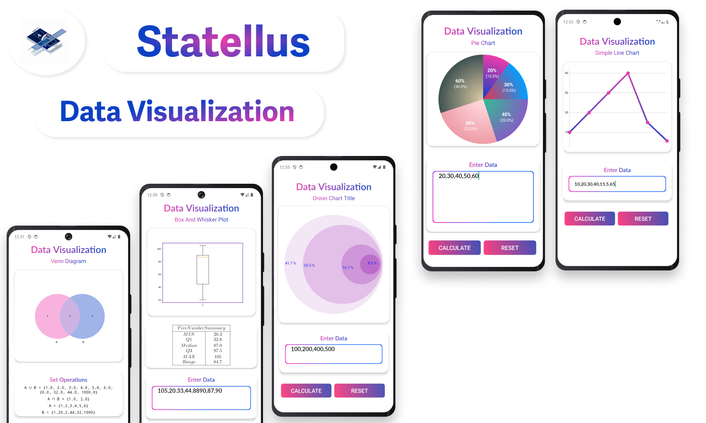

[![Duquense-Shield][Duquesne-Shield]][Duquesne-url]
<svg xmlns="http://www.w3.org/2000/svg" width="120" height="29">
  <defs>
    <linearGradient id="grad1" x1="0%" y1="0%" x2="100%" y2="0%">
      <stop offset="0%" style="stop-color:#EC3CAB;stop-opacity:1" />
      <stop offset="100%" style="stop-color:#0B40C5;stop-opacity:1" />
    </linearGradient>
  </defs>
  <rect width="150" height="40" fill="url(#grad1)" />
 <image href="Images/statellus_readme_badge.png" x="10" y="5" height="30" width="30"/>
  <text x="60%" y="50%" alignment-baseline="middle" text-anchor="middle" font-family="Arial" font-size="15" fill="white">Statellus</text>
</svg>

<h1>About the Project</h1>
This Android Studio project is designed to cater to the needs of college students taking courses in Discrete Math, Probability, Calculus, and Statistics. The Project will not only provides essential calculation resources for these subjects but also provide data visualization tools. 
<h1>

<h1>App Preview </h1>

<h1>Tech Stack </h1>
 
 ### &emsp; 

 ### &emsp; 

 ###  &emsp; 

 ### &emsp;  
<h1>
 

<h1>Libraries</h1>

- <a href="https://commons.apache.org/proper/commons-math/">Commons Math: The Apache Commons Mathematics Library<a/>  
    * Commons Math is a library of lightweight, self-contained mathematics and statistics components addressing the most common problems not available in the Java programming language or Commons Lang.

- <a href="https://github.com/Kotlin/dokka">Dokka <a/>  
	* Dokka is an API documentation engine for Kotlin.

	* Just like Kotlin itself, Dokka supports mixed-language projects. It understands Kotlin's KDoc comments and Java's Javadoc comments.

	* Dokka can generate documentation in multiple formats, including its own modern HTML format, multiple flavors of Markdown, and Java's Javadoc HTML.
#

- <a href="https://github.com/google/guava/tree/master">Guava <a/>  
	* By replacing the existing library classes with those from guava, you can reduce the amount of code you need to maintain
	* It provides Optimized, thoroughly tested math utilities not provided by the JDK
	* It provides powerful collection utilities, for common operations not provided in java.util.Collections
#

- <a href="https://github.com/google/guava/tree/master">Parserng-android <a/> 
	* Andorid Fork of <a href="https://github.com/google/guava/tree/master">Parserng<a/> 

	*  <a href="https://github.com/google/guava/tree/master">Parserng<a/> 
		* a powerful open-source math tool that parses and evaluates algebraic expressions and also knows how to handle a lot of mathematical expressions. Including: Arithmetic, statistical, Calculus Operations etc.  
#

-  <a href="https://github.com/noties/jlatexmath-android">jlatexmath-android<a/> 
	* Andorid Fork of <a href="https://github.com/google/guava/tree/master">jlatexmath<a/> 
	*  <a href="https://github.com/google/guava/tree/master">jlatexmath<a/> 
		* JLaTeXMath is a Java library. Its main purpose is to display mathematical formulas written in LaTeX. JLaTeXMath is the best Java library to display LaTeX code.
#
- <a href="https://github.com/PhilJay/MPAndroidChart">MPchart <a/>  
	* MP chart is the best **free** chart library for data visualization in android 
#

- <a href="https://github.com/puskal-khadka/OnionDiagram">Onion Diagram <a/>  
	* Android library for onion diagram i.e also refered as stacked vann diagram
#

- <a href="https://github.com/google/guava/tree/master">Chaquopy <a/>  
	* Chaquopy provides everything you need to include Python components in an Android app, including: Full integration with Android Studio’s standard Gradle build system, Simple APIs for calling Python code from Java/Kotlin, and vice versa.
	* **Use chaquopy when MPchart is not sufficent**
### Python Libraries 
- <a href="https://matplotlib.org/">Mathplotlib <a/>  
	* Matplotlib is a comprehensive library for creating static, animated, and interactive visualizations in Python. Matplotlib makes easy things easy and hard things possible.

- <a href="http://stemgraphic.org/">Stemgraphic <a/>  
	* toolkit for text and a graphical stem-and-leaf plots and other visualizations adapted to stem-and-leaf pair values, such as heatmaps and sunburst charts.
#

- [Shields.io](https://shields.io/) - Markdown README.md Badges

[Duquesne-Shield]: https://custom-icon-badges.demolab.com/badge/-Duquesne%20University-ba0c2f?style=for-the-badge&logo=duquesne_dukes_logo1
[Statellus-Shield]: https://custom-icon-badges.demolab.com/badge/-Duquesne%20University-ba0c2f?style=for-the-badge&logo=logo=statellus_app_icon_1
[Duquesne-url]: https://duq.edu
