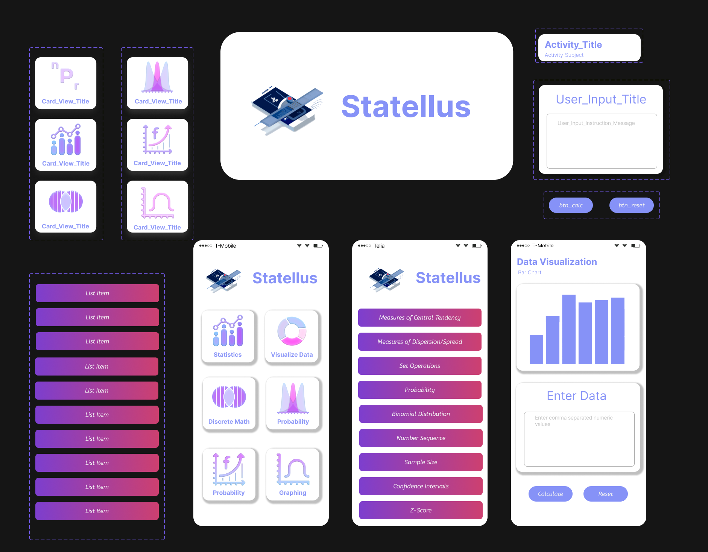

## Project Structure 

/app 
&emsp;|-- /src 
&emsp;&emsp;|-- /main 
&emsp;&emsp;&emsp;|-- /java 
&emsp;&emsp;&emsp;&emsp;|-- /com.blazewheeler.statellus 
&emsp;&emsp;&emsp;&emsp;&emsp;|-- /java 
&emsp;&emsp;&emsp;&emsp;&emsp;&emsp;|-- /View 
&emsp;&emsp;&emsp;&emsp;&emsp;&emsp;&emsp;|--/java views 
&emsp;&emsp;&emsp;&emsp;&emsp;&emsp;|--/ViewModel 
&emsp;&emsp;&emsp;&emsp;&emsp;&emsp;&emsp;|--/java ViewModels 
&emsp;&emsp;&emsp;&emsp;&emsp;&emsp;|--/Model 
&emsp;&emsp;&emsp;&emsp;&emsp;&emsp;&emsp;|--/Model(Java Calculations Logic) 
&emsp;&emsp;&emsp;&emsp;&emsp;|-- /Kotlin 
&emsp;&emsp;&emsp;&emsp;&emsp;&emsp;|-- /View 
&emsp;&emsp;&emsp;&emsp;&emsp;&emsp;&emsp;|--/Kotlin views 
&emsp;&emsp;&emsp;&emsp;&emsp;&emsp;|--/ViewModel 
&emsp;&emsp;&emsp;&emsp;&emsp;&emsp;&emsp;|--/Kotlin ViewModels 
&emsp;&emsp;&emsp;&emsp;&emsp;&emsp;|--/Model 
&emsp;&emsp;&emsp;&emsp;&emsp;&emsp;&emsp;|--/Model(Koglin Calculations Logic) 
&emsp;&emsp;&emsp;&emsp;&emsp;|-- /python 
&emsp;&emsp;&emsp;&emsp;&emsp;&emsp;|-- python modules 
|-- /res 
&emsp;|-- /values 
&emsp;&emsp;|-- strings.xml 
|-- /layout 
&emsp;|-- activity_main.xml 
|-- /drawable 
|-- /mipmap 
|-- AndroidManifest.xml 
|-- build.gradle 

#
The project uses a MVVM approach. MVVM - MODEL VIEW VIEWMODEL ensures each ViewModel, in the scope of this project is responsible for handling the UI-related logic for its associated View, *(i am referring to android activities)* and the associated Model contains the business logic and calculations, *(in the scope of this project the model will have calculations, and methods to format data to specfic API input requirements)* Python modules handle logic needed to use python. libraries.
#

# API LEVEL 
This application targets the andorid API LEVEl 34 with a MIN of 30. 

* The application is supported on 74.2% of all android devices. 
	* See <a href ="https://apilevels.com/"> Android API Levels</a> for more information.
#

## Mockup

